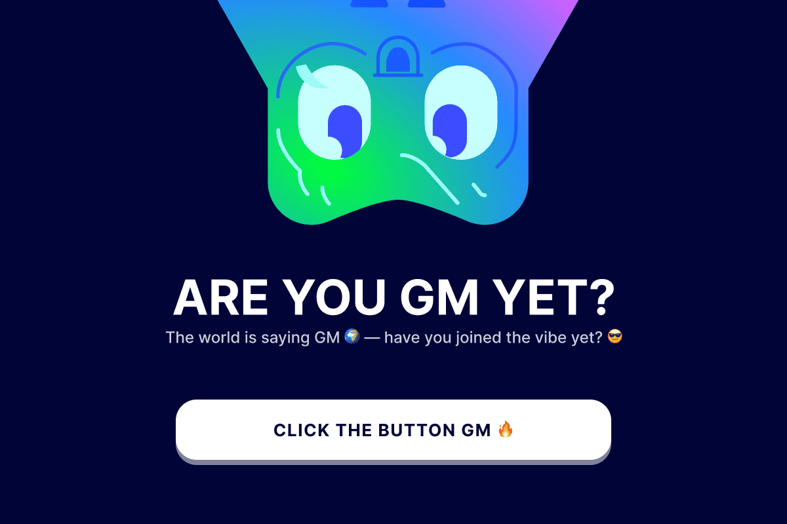

# GMonchain: Your Gateway to Web3



## Technologies Used

  

## Unlocking Web3 for Everyone

GMonchain is on a mission to simplify the world of blockchain for newcomers, especially those joining the Farcaster ecosystem. We understand that the transition to decentralized applications can be daunting, which is why we've crafted an intuitive and friendly entry point. Our focus on an exceptional user experience ensures that interacting with blockchain technology is not just easy, but enjoyable.

By providing a seamless onboarding journey, GMonchain empowers users to confidently take their first steps into Web3, setting the stage for deeper exploration of complex decentralized applications in the future.

## Navigating the Challenges

Building a product that prioritizes user experience and reliability is a continuous journey. We constantly strive to optimize GMonchain, ensuring a smooth and dependable platform for all our users.

User retention is another critical area we're actively addressing. To foster a vibrant and engaged community, we've rolled out exciting initiatives suchs as weekly reward events, generously supported by the Farcaster Rewards program.

Furthermore, GMonchain incorporates a unique daily token claim feature. While the daily rewards are modest, they serve as a powerful incentive, encouraging consistent interaction and building a daily habit around our miniapp.

## Dive Deeper: Smart Contracts & Onchain Proof

### GM Token Contract
```
0x2e6b57fbd2c3c8d2e891511d4621a34712fc1094
```

### Daily Token Claim Contract
```
0x208645498f470fb49b824237b1784c18cf34ce19
```

### Innovative Staking Mechanism

Following the success of Airdrop Season 1, we've introduced an advanced staking mechanism designed to reward our dedicated community.

Users can stake their \$GM tokens in a dedicated pool. Weekly snapshots determine reward distribution for both stakers and holders. To ensure fairness and prevent manipulation, rewards are distributed randomly throughout the week.

#### Staking Contract (Rebase)
```
0x89fa20b30a88811fbb044821fec130793185c60b
```

#### Distribution Contract
```
0x6bc86cb06db133e939cc9d3cd27b6b34772dd0cb
```